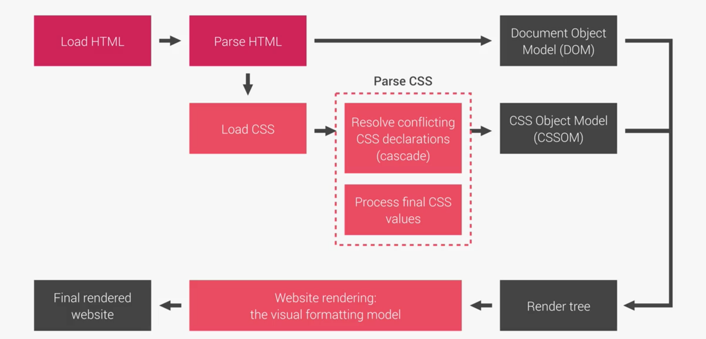

#### 1. PAGE STURCTURE

#### 2. CSS Rule

#### 3. Unit & Inheritance

#### 4. Design

- THINK :

  - Component-driven design (atomic design)
  - Re-usable
  - Independent

- BUILD :

  - BEM (Block Element Modifiler)
    - Block: standalone component => .block {}
    - Element: part of block that has no standaline meaning => .block\_\_element {}
    - Modifiler: a difference version of block or element => .block--modifier {}

- ARCHITECT :

  - The 7-1 Pattern

    - 7 different for sass file.
    - 1 main sass

      the 7 folder
      ./base
      ./component
      ./layout
      ./pages
      ./themes
      ./abstact
      ./vendors
